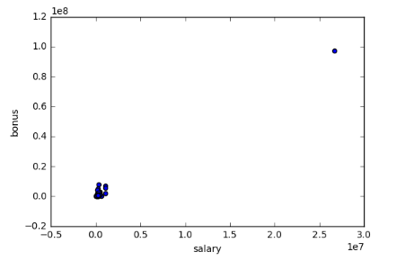
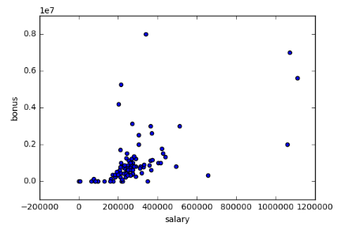
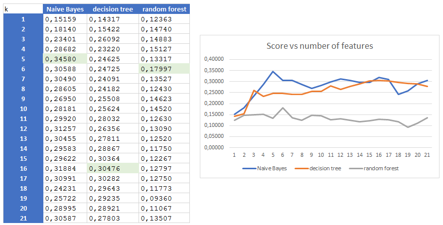
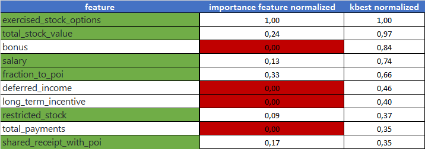
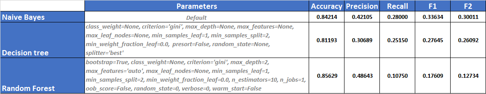
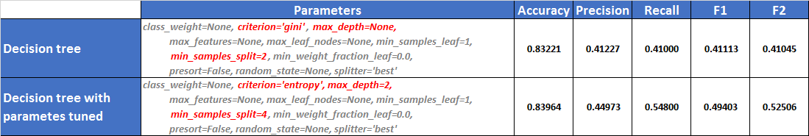
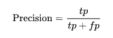
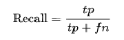
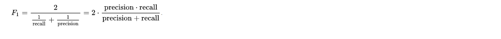

# Identify Fraud from Enron Email

### Author: Francisco Cerezo
### 20/03/2018


## Understanding the Dataset and Question

___Summarize for us the goal of this project and how machine learning is useful in trying to accomplish it. As part of your 
answer, give some background on the dataset and how it can be used to answer the project question. Were there any outliers in the data when you got it, and how did you handle those?  [relevant rubric items: “data exploration”, “outlier investigation”]___


The Enron fraud case, publicized in October 2001, eventually led to the bankruptcy of the Enron Corporation, an American energy company based in Houston, Texas, and the de facto dissolution of Arthur Andersen, which was one of the five largest audit and accountancy partnerships in the world. At the end of the investigation the email database was put on the public domain to be used for historical research and academic purposes.

The purpose of this project is to use machine learning techniques to identify person of interest (POIS) within the fraud case based of this email database. POI's definition is people: indicted, settled without admitting guilt, or testified in exchange of immunity.


### Dataset exploration

The data about the Enron email and financial data has been preprocessed into a dictionary, where each key-value pair in the dictionary corresponds to one person. Exploring this dictionary, we can observe the following characteristics:


```python
import pickle
# load dataset
enron_data = pickle.load(open("../final_project/final_project_dataset.pkl", "r"))
print "Number of elements in the dataset: "+str(len(enron_data))
```

    Number of elements in the dataset: 146
    


```python
# count POIs/non-POIs in the dataset
i=0
for elem in enron_data:
    if enron_data[elem]["poi"]==1:
        i=i+1
    
print "Number of POIs: "+ str(i)
print "Number of non-POIs: "+ str(len(enron_data)-i)
```

    Number of POIs: 18
    Number of non-POIs: 128
    

As we can see there are only 18 from 146 people categorized as POI in our dataset. This means that our dataset is clearly unbalanced on POI category and we should take this into consideration when selecting, training and tuning up our classifier.

Note: In the "poi_names.txt" we have 35 POIs manually identify. We could thin in to complete de dataset with this additional POIs. Unfortunately, we do not have the financial information related to the additional POIs.


```python
print "Number of Features used: "+str(len(enron_data['METTS MARK'].keys()))
```

    Number of Features used: 21
    


```python
pprint.pprint(enron_data[next(iter(enron_data))])
```

    {'bonus': 600000,
     'deferral_payments': 'NaN',
     'deferred_income': 'NaN',
     'director_fees': 'NaN',
     'email_address': 'mark.metts@enron.com',
     'exercised_stock_options': 'NaN',
     'expenses': 94299,
     'from_messages': 29,
     'from_poi_to_this_person': 38,
     'from_this_person_to_poi': 1,
     'loan_advances': 'NaN',
     'long_term_incentive': 'NaN',
     'other': 1740,
     'poi': False,
     'restricted_stock': 585062,
     'restricted_stock_deferred': 'NaN',
     'salary': 365788,
     'shared_receipt_with_poi': 702,
     'to_messages': 807,
     'total_payments': 1061827,
     'total_stock_value': 585062}
    

Attending to this the list of features for each people included in the dataset can be organized in 3 distinct groups:

__· financial features:__ ['salary', 'deferral_payments', 'total_payments', 'loan_advances', 'bonus', 'restricted_stock_deferred', 'deferred_income', 'total_stock_value', 'expenses', 'exercised_stock_options', 'other', 'long_term_incentive', 'restricted_stock', 'director_fees'] (all units are in US dollars)

__· email features:__ ['to_messages', 'email_address', 'from_poi_to_this_person', 'from_messages', 'from_this_person_to_poi', 'shared_receipt_with_poi'] (units are generally number of emails messages; notable exception is ‘email_address’, which is a text string)

__· POI label:__ [‘poi’] (boolean, represented as integer)


```python
# count missing value for each features in the dataset
missing_values = {}
for feature in enron_data['METTS MARK'].keys():
    missing_values[feature] = 0

for elem in data_dict:
    for f in data_dict[elem]:
        if data_dict[elem][f] == 'NaN':
            missing_values[f] += 1
            # fill NaN values
            #data_dict[emp][f] = 0

pprint.pprint(missing_values) 
```

    {'bonus': 63,
     'deferral_payments': 105,
     'deferred_income': 95,
     'director_fees': 127,
     'email_address': 33,
     'exercised_stock_options': 43,
     'expenses': 50,
     'from_messages': 58,
     'from_poi_to_this_person': 58,
     'from_this_person_to_poi': 58,
     'loan_advances': 140,
     'long_term_incentive': 79,
     'other': 53,
     'poi': 0,
     'restricted_stock': 35,
     'restricted_stock_deferred': 126,
     'salary': 50,
     'shared_receipt_with_poi': 58,
     'to_messages': 58,
     'total_payments': 21,
     'total_stock_value': 19}
    

We can see that there is a lot of missing values in the features of the dataset. This is another important point that we should keep in mind when doing the features selection.

After this quick dataset exploration, we know that he whole dataset is composed by 146 people and only 18 of them are POIs. On addition to it, there are a lot of values mission in some of the features.

The low size of the dataset, the unbalancing in POIs categories and the existence of missing values are very important points that we should take into consideration later, when we work on the feature selection and in the classifier selection and tune up. Due to all these problems, probably the performance of the classifier will be not as good as we would like it. Anyway, we will see what we can get with this dataset.


### Outliers

As we discovered previously in during the miniproject, if we plot bonus vs. salary, there is an outlier data point representing the 'TOTAL' due to a spreadsheet quirk.


```python
### Load the dictionary containing the dataset
with open("final_project_dataset.pkl", "r") as data_file:
    data_dict = pickle.load(data_file)

### Task 2: Remove outliers
import matplotlib.pyplot
from feature_format import featureFormat, targetFeatureSplit

# Extract data to be plot in the scatter chart
features = ["salary", "bonus"]
data = featureFormat(data_dict, features)
# plot the scatter chart
for point in data:
    salary = point[0]
    bonus = point[1]
    matplotlib.pyplot.scatter( salary, bonus )

matplotlib.pyplot.xlabel("salary")
matplotlib.pyplot.ylabel("bonus")
matplotlib.pyplot.show()
```



If we remove the outlier and plot the chart again we can see de difference now:


```python
### Remove 'TOTAL' outlier
data_dict.pop('TOTAL', 0)
```



By Inspecting the list of people included on the dataset I realized about another strange value 'THE bTRAVEL AGENCY IN THE PARK' that clearly not represent to a separated person, so I decided to remove it also.


```python
### Remove 'THE TRAVEL AGENCY IN THE PARK' element
data_dict.pop('THE TRAVEL AGENCY IN THE PARK', 0)
```


## Optimize Feature Selection/Engineering


__What features did you end up using in your POI identifier, and what selection process did you use to pick them? Did you have to do any scaling? Why or why not? As part of the assignment, you should attempt to engineer your own feature that does not come ready-made in the dataset -- explain what feature you tried to make, and the rationale behind it. (You do not necessarily have to use it in the final analysis, only engineer and test it.) In your feature selection step, if you used an algorithm like a decision tree, please also give the feature importances of the features that you use, and if you used an automated feature selection function like SelectKBest, please report the feature scores and reasons for your choice of parameter values.  (relevant rubric items: “create new features”, “intelligently select features”, “properly scale features”)__


### Create new features 

I decided to engineer two new features and add them into my dataset:

__· fraction_from_poi:__ ratio of the messages from POI to this person against all the messages sent to this person.

__· fraction_to_poi:__ ratio from this person to POI against all messages from this person

The assumption which drives me to create those features is that the percentage of mails that a POI sent/received to/from another POIS should be higher than the non-POIs.


```python
### Task 3: Create new feature(s)
def computeFraction( poi_messages, all_messages ):
    """ given a number messages to/from POI (numerator) 
        and number of all messages to/from a person (denominator),
        return the fraction of messages to/from that person
        that are from/to a POI
   """
    fraction=0
    if poi_messages != 'NaN' and all_messages != 'NaN':
		fraction = poi_messages/float(all_messages)
    return fraction

for name in data_dict:

    data_point = data_dict[name]
    # add fraction_from_poi to the dataset as ratio of the messages from POI to this person
    # against all the messages sent to this person.
    from_poi_to_this_person = data_point["from_poi_to_this_person"]
    to_messages = data_point["to_messages"]
    data_point["fraction_from_poi"] = computeFraction( from_poi_to_this_person, to_messages )
    # add fraction_to_poi to the dataset as ratio from this person to POI against all messages
    #from this person
    from_this_person_to_poi = data_point["from_this_person_to_poi"]
    from_messages = data_point["from_messages"]
    data_point["fraction_to_poi"] = computeFraction( from_this_person_to_poi, from_messages )
```

### Intelligently select features  and Feature scaling

As we know Features is not the same than information. For feature selection I used GridSearchCV to find the influence of the number of features in the score across different classifiers: Naive Bayes, decision tree and random forest
To select the number of features We need to take keep in mind the tradeoff between maximizes F1-score but not to use to much features to avoid overfitting an number of features According to the results we can see that:



We can see that for GridSearchCV the best k=5, for decision tree k=16 and for random forest k=. With this information I decided to choose a number of features between 5 and 10 since the f1 score remain more or less constant for the classifiers and the reduction of the number of features would help us with the overfitting.

Additionally, I used "feature_importance" from the decision tree to rank the more important features for this criteria and filter the previously top 10 features ranked by selectKbest:



For the selection of the features I decided to use the SelectKBest function, which selects the K features with the highest scores. I used k=10 and I obtained the following results on my dataset:

Finally I got these 6 features as the most suitable for my choice:
['poi','exercised_stock_options','total_stock_value','salary', 'fraction_to_poi', 'restricted_stock','shared_receipt_with_poi']


### Properly scale features

Before I used SelectKBest function and the decission tree  classifier I performed some feature scaling in the code since the magnitudes are quite different and it could impact in our analysis depending on the type of algorithm that we use later. However as in the next paragraphs we decided to use Decision Tree classifier, the performance is not affected by this because this algorithm does not require feature scaling (needed for those algorithm bases on Euclidean distances like k_means)


```python
# Scale features
scaler = MinMaxScaler()
features = scaler.fit_transform(features)
# Note that we do it just to show feature scaling example. If fact the final classifier algortihm chosen(decission tree)
# is not based in Euclidean distances and it is not affected for the different magnitudes in the features.
```

## Pick and Tune an Algorithm

___What algorithm did you end up using? What other one(s) did you try? How did model performance differ between algorithms?  (relevant rubric item: “pick an algorithm”)___


### Pick an algorithm
I decided to compare 3 classifiers: Naive Bayes, decision tree and random forest and I tried the performance using the "tester.py" function provided by Udacity as helper:


```python
# Create Naibe Bayes classifier
from sklearn.naive_bayes import GaussianNB
clf1 = GaussianNB()

# Create DecisionTree classifier with defaults pparameters
clf2 = tree.DecisionTreeClassifier()

# Create Ramdom Forest classifier 
from sklearn.ensemble import RandomForestClassifier
clf3= RandomForestClassifier(max_depth=2, random_state=0)

# use tester.py to compare accuracy, precision, recall F1
test_classifier(clf1, my_dataset, features_list)
test_classifier(clf2, my_dataset, features_list)
test_classifier(clf3, my_dataset, features_list)

```



Based on these results I selected the decision tree classifier which maximizes Precision, Recall and F1 and F2 score and had a similar accuracy than the rest.

## Parameter tuning and its importance.

___What does it mean to tune the parameters of an algorithm, and what can happen if you don’t do this well?  How did you tune the parameters of your particular algorithm? What parameters did you tune? (Some algorithms do not have parameters that you need to tune -- if this is the case for the one you picked, identify and briefly explain how you would have done it for the model that was not your final choice or a different model that does utilize parameter tuning, e.g. a decision tree classifier).  [relevant rubric items: “discuss parameter tuning”, “tune the algorithm”]___

Most of the classifier owns a set of parameters that can be modified to improve the results over our dataset. The Default values for the classifier are not always the ones with the better performance, so you need to try different parameters configuration to find the best combination.

To perform this tuning, we need to consider trade-off between Bias and Variance:
· If we perform too little the parameters we could oversimplify, or classifier and It would core poorly in our dataset.
· On the other side, if tune to much the parameters we could overfit our classifier and it will work properly in our dataset, but it could show a deficient performance when It is used on unseen data.


### Tune the algorithm
I used "GridSearchCV" to try several parameters within my Decision tree classifier:


```python
from sklearn import grid_search
from sklearn.cross_validation import StratifiedShuffleSplit
# Create the parameter set to be tested in our Decision Tree clasifier
parameters = {'criterion':('gini', 'entropy'),
              'min_samples_split':[2,3,4],
              'max_depth':[None,2,4,6]
              }

# Get features & labels
data = featureFormat(my_dataset, features_list, sort_keys = True)
labels, features = targetFeatureSplit(data)
# Use StratifiedShuffleSplit to avoid problems due to the higly balanced cateogories ans the & small size of our  dataset
cv = StratifiedShuffleSplit(labels, n_iter = 1000,random_state = 42)
# Run test over the different parameters
clfs = grid_search.GridSearchCV( tree.DecisionTreeClassifier(), param_grid = parameters,cv = cv, scoring = 'f1').fit(features, labels)
# Get best estimator from results
clf= clfs.best_estimator_

#test the final performance of our tune Decision tree classifier
test_classifier(clf, my_dataset, features_list)
```

As it is shown in the code, the parameters and the values that I select to test were:

    •	Criterion:['gini', 'entropy'] The function to measure the quality of a split. Supported criteria are “gini” for the Gini impurity and “entropy” for the information gain.

    •	min_samples_split':[2,3,4] The minimum number of samples required to split an internal node

    •	max_depth':[None,2,4,6] The maximum depth of the tree. If None, then nodes are expanded until all leaves are pure or until all leaves contain less than min_samples_split samples.

After the run the test "GridSearchCV" tell us that for the min_samples_split and max_depth the best value was the default one. However, for the "criterion" parameter the "entropy" value shows better performance that the default one "gini". This tuning improves all the scores of our classifier, even if we have modified only one parameter from the default classifier:




## Validate and Evaluate

___What is validation, and what’s a classic mistake you can make if you do it wrong? How did you validate your analysis?  [relevant rubric items: “discuss validation”, “validation strategy”]___

Validation is the strategy to evaluate the performance of the model on unseen data. A classic mistake is to use the same dataset to train and test the classifier. On this case, the performance would be better than it really does (leading to overfitting) but in fact, we will have no idea about how our classifier works on unseen data.

My validation strategy has been to use Stratified Shuffle Split included in the "tester.py" code provided by Udacity which randomly choose training and testing test in our dataset multiples times and average the results. This is important in our dataset since it is highly unbalanced (18 POIs and 128 non-POIs) and very small.


## Evaluation Metrics 

___Give at least 2 evaluation metrics and your average performance for each of them.  Explain an interpretation of your metrics that says something human-understandable about your algorithm’s performance. [relevant rubric item: “usage of evaluation metrics”]___


### Precision: 0.46

If I have a good precision it means that whenever a POI gets flagged in my test set, I know with a lot of confidence that it’s very likely to be a real POI and not a false alarm. On the other hand, the price I pay for this is that I sometimes miss real POIs, since I’m effectively reluctant to pull the trigger on edge cases.

tp: true positive<br />
np: false negative


### Recall: 0.41

If I have a good recall it means nearly every time a POI shows up in my test set, I can identify him or her. The cost of this is that I sometimes get some false positives, where non-POIs get flagged.

tp: true positive<br />
np: false negative

### F1 score: 0.43

If I have a good F1 score that means that when my identifier finds a POI then the person is almost certainly a POI, and if the identifier does not flag someone, then they are almost certainly not a POI.

